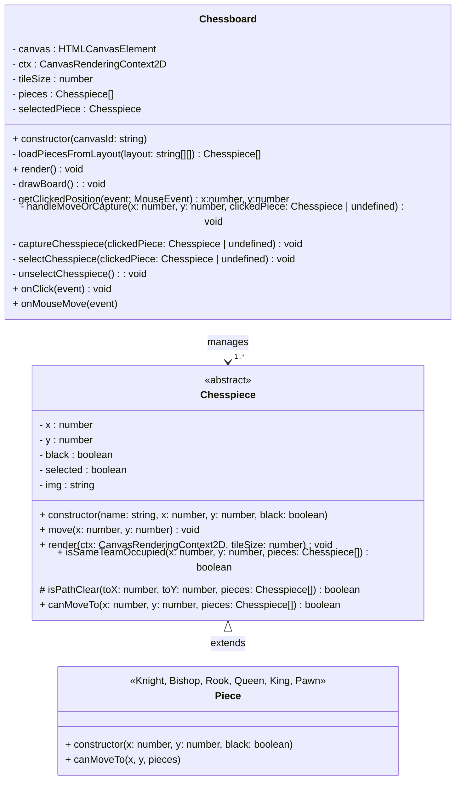
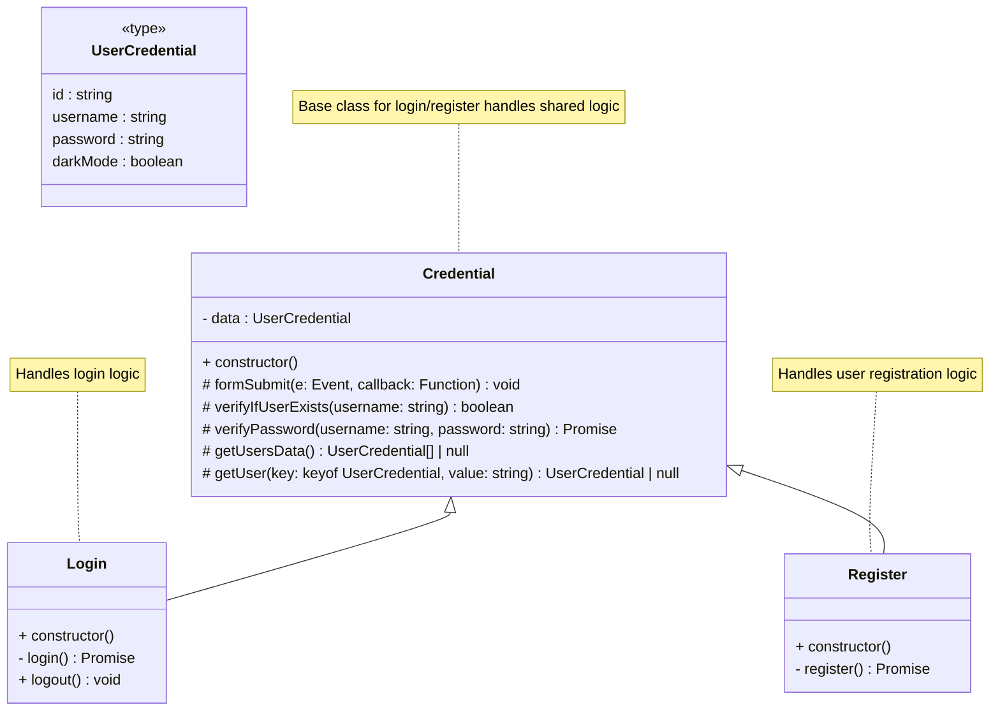

<br><br>
<h1  align="center"><i>Typescript</i> Chess</h1>

A simple, canvas-rendered chess game built from scratch in *TypeScript* using the Oriented-Object Programming paradigm—designed for two players sharing the same machine. This project focuses on clean architecture, JSDoc-friendly code, and a component-based structure, all without the aid of frameworks or libraries beyond what's essential.
> [!NOTE]
> This project is offline-only for now. However, future updates may include online gameplay through sharable URL rooms.

---

## Features Implemented
1. Vanilla TypeScript powered by Vite for fast development and hot reloads.

2. Lightweight, local authentication system using:
   * Bcrypt password hashing with salt
   * 500ms artificial delay to discourage brute-force attacks

3. Fully playable chess engine rendered on HTML Canvas
    * Turn-based play using a chessboard modeled in OOP
    * Pieces extend a base class with strong class inheritance

4. Optional background music:
    * Muted by default on page load
    * Users can toggle audio via UI

5. Clean and extensible project structure

6. Experimental login/registration system using localStorage

---

## Upcoming Ideas
> [!TIP]
> These ideas are under consideration but not yet implemented. Contributions or suggestions are welcome.

- [ ] Online multiplayer via sharable room URLs
- [ ] Clock implementation for classic or blitz gameplay
- [ ] Visual game start/end logic and win conditions
- [ ] Option to use a local database for storing user credentials instead of localStorage

---

## Project Structure Overview

``` bash
    ├──index.html
    ├──dist/
    ├──LICENSE
    ├──package.json
    ├──package-lock.json
    ├──public
    │   └── login.html
    ├──README.md
    ├──src
    │   ├──assets
    │   │   ├──images          # Chess piece assets (see credits)
    │   │   └──sound           # 8-bit background music
    │   ├──components/         # UI-related modules
    │   ├──core/               # Core logic (TBD)
    │   ├──index.ts            # Main entrypoint
    │   ├──login.ts            # Login flow
    │   ├──models/             # Chess pieces, board, credentials
    │   ├──style/              # CSS modules
    │   └──utils/              # Utility classes & helpers
    └──tsconfig.json
```

---

## Installation & Setup

> [!IMPORTANT]
> Ensure you have Node.js and npm installed before continuing.

``` bash
# Clone the repo
git clone https://github.com/your-username/typescript-chess.git

# Navigate to the project directory
cd typescript-chess

# Install dependencies
npm install

# Run the development server
npm run start

```
Open http://localhost:5173 in your browser.

---

## Classes & Diagrams     
The following class diagrams provide a high-level overview of the object-oriented architecture powering the game logic and user authentication system in this TypeScript-based chess application.

### Game Engine Architecture


> [!NOTE]
> This diagram represents the core gameplay engine, designed using strong object-oriented principles. The `Chessboard` class manages rendering, interaction, and state tracking. It orchestrates a collection of polymorphic `Chesspiece` instances, each implementing movement logic via the `canMoveTo()` method.

* The `Chesspiece` class is abstract, with all concrete piece types (♖ Rook, ♘ Knight, ♗ Bishop, ♕ Queen, ♔ King, ♙ Pawn) inheriting from it.
* Movement validation and rendering are encapsulated in each piece class, allowing for extensibility and modularity.
* The canvas is the heart of the UI, with dynamic response to user input (`onClick`, `onMouseMove`) driven by a composition of DOM and canvas logic.


### User Authentication Logic


> [!TIP]
> The authentication system is modular and reusable, structured around a base `Credential` class that provides shared methods for managing users, credentials, and storage.

* `Login` and `Register` extend `Credential`, encapsulating login and registration-specific workflows.
* Passwords are hashed using `bcrypt` and stored locally. There's a 500ms delay on authentication to mitigate brute-force attacks.
* `UserCredential` is a TypeScript type defining the data shape for each user.

> [!IMPORTANT]
> While the current implementation uses `localStorage`, the architecture is flexible and can be extended in the future to support a local database or even online authentication.

---

## Assets & Credits

This project would not be possible without the following artists:

### Chess piece sprites
  * Created by [Lucas312](https://opengameart.org/content/pixel-chess-pieces) — freely available on OpenGameArt.

### Background Music
  * SYMPHONY Nº 9 (Dvořák) 8-bit Remix by [Alejandro Samper Báidez](https://www.youtube.com/watch?v=EDx-2hNoQ0k)

> [!CAUTION]
> These assets are for non-commercial use only unless the original license says otherwise. Always give credit when redistributing or modifying.

---

## Developer Notes
This game is a sandbox to explore:

1. The TypeScript language
2. Principles of Object-Oriented Programming
3. Documenting code using JSDoc
4. Building modular components without relying on modern frameworks

The gameplay and logic are intentionally minimal at this stage, with a focus on architecture, extensibility, and learning.

---

## License
This project is licensed under the [MIT License](LICENSE).

